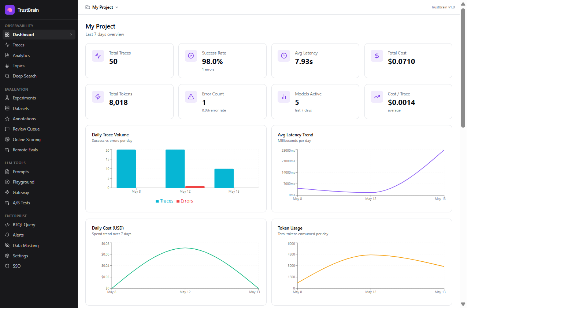
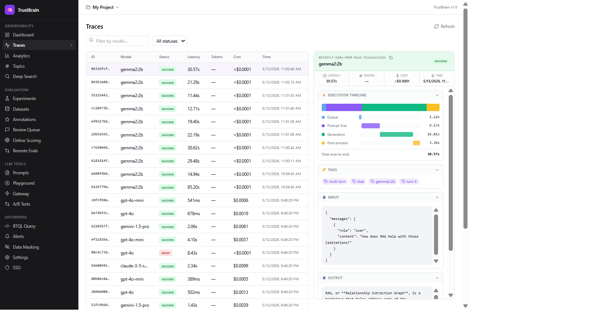

# 🧠 TrustBrain — Open Source AI Observability Platform

A fully self-hosted AI observability and evaluation platform for monitoring, testing, and improving LLM applications in production.

## What is TrustBrain?

TrustBrain helps AI teams:
- **Observe** production LLM traces with full visibility into cost, latency, and quality
- **Evaluate** outputs using LLM, code, or human scorers
- **Compare** models and prompts side-by-side with experiment tracking
- **Catch** regressions before they reach production
- **Iterate** continuously with real production data

Supports any LLM provider — OpenAI, Anthropic, Google, and local models via **Ollama** (zero cost).

---

## 📚 Documentation

> **For detailed documentation, refer to the [`docs/`](./docs/) folder:**
>
> | Guide | Description |
> |---|---|
> | [docs/INSTALLATION.md](./docs/INSTALLATION.md) | Full setup & Docker guide, environment variables, troubleshooting |
> | [docs/PAGES_GUIDE.md](./docs/PAGES_GUIDE.md) | Dashboard pages walkthrough — every chart, KPI, and feature explained |
> | [docs/SDK_INTEGRATION.md](./docs/SDK_INTEGRATION.md) | How to send traces — SDK, REST API, Ollama, LangChain, decorators |
> | [docs/README.md](./docs/README.md) | Architecture overview and full feature list |

---

## 🚀 Quick Start

### Prerequisites

- [Docker Desktop](https://www.docker.com/products/docker-desktop/) 4.x + Docker Compose 2.x

### Start All Services

```bash
git clone <repo-url>
cd Exp_braintrust
docker-compose up -d
```

| Service | URL |
|---|---|
| Dashboard (Next.js) | http://localhost:3010 |
| Backend API (FastAPI) | http://localhost:8000 |
| API Docs (Swagger) | http://localhost:8000/docs |

1. Open http://localhost:3010, click **Sign In**, enter your email — no password needed.
2. Create a project from the top-bar project selector.
3. Start sending traces (see [docs/SDK_INTEGRATION.md](./docs/SDK_INTEGRATION.md)).

> For full installation details, environment variables, and troubleshooting see **[docs/INSTALLATION.md](./docs/INSTALLATION.md)**.

---

## ⚡ Try It — Ollama Live Demo

Stream live traces from local Ollama models at zero cost:

```bash
pip install rich requests
python examples/ollama_live_demo/live_demo.py
```

Open http://localhost:3010/traces and watch traces arrive in real-time.

---

## � Screenshots

**Dashboard** — 8 KPI cards, 6 charts, model performance table


**Traces** — list view with execution timeline, token breakdown, and tags in the detail panel


**Login** — passwordless, JWT-based authentication


---

## 🛠️ Architecture

```
TrustBrain/
├── backend/                    # FastAPI REST API (port 8000)
│   ├── main.py                 # App entry point
│   ├── config.py
│   ├── database.py
│   ├── scoring.py              # Evaluation engine
│   ├── pricing.py
│   ├── routes/                 # All /api/* endpoints
│   │   ├── traces.py
│   │   ├── auth.py
│   │   ├── projects.py
│   │   ├── evals.py
│   │   ├── experiments.py
│   │   ├── analytics.py
│   │   ├── gateway.py
│   │   ├── review.py
│   │   ├── prompts.py
│   │   ├── datasets.py
│   │   └── ...                 # 20+ route modules
│   └── search/                 # Semantic search + Qdrant
├── frontend-react/             # Next.js 14 dashboard (port 3010)
│   ├── app/                    # App Router pages
│   ├── components/             # Shared UI components
│   ├── lib/                    # API client, utils
│   └── types/                  # TypeScript interfaces
├── sdk/                        # Python SDK
│   └── traciq/
│       ├── client.py           # TraceIQClient
│       ├── decorators.py       # @traciq_trace
│       └── integrations/       # OpenAI, LangChain patches
├── database/                   # SQLAlchemy models + migrations
├── examples/
│   └── ollama_live_demo/       # Live Ollama tracing demo
├── docs/                       # Full documentation ← start here
│   ├── screenshots/
│   ├── INSTALLATION.md
│   ├── PAGES_GUIDE.md
│   └── SDK_INTEGRATION.md
├── k8s/                        # Kubernetes manifests
├── monitoring/                 # Prometheus + Grafana config
├── tests/                      # Backend + SDK test suites
├── Dockerfile.backend
├── Dockerfile.frontend
└── docker-compose.yml
```

---

## ✅ Features

| Category | Features |
|---|---|
| **Tracing** | Single & batch ingestion, spans, tags, metadata, environment labels |
| **Observability** | 8 KPI cards, 6+ charts, model comparison table, recent traces |
| **Detail Panel** | Execution timeline (Gantt), token breakdown, collapsible sections |
| **Evaluation** | LLM judge, exact match, JSON schema, code scorers |
| **Experiments** | Regression detection vs baseline, severity classification |
| **Gateway** | Unified LLM proxy with streaming (SSE) and caching |
| **Review Queue** | Human review workflow, auto-flag low-score traces |
| **Datasets** | Golden datasets for repeatable evaluation |
| **Annotations** | Human labels linked to traces |
| **Prompts** | Version-controlled prompt templates |
| **Search** | Full-text + semantic search via Qdrant |
| **Analytics** | Time-series for cost, latency, tokens, errors |
| **Auth** | Passwordless JWT auth, static API keys per user |
| **Ollama** | Local models at $0.00 cost, full trace support |

---

## 📄 License

MIT License

---

**For all other details — setup, pages, API integration — see the [`docs/`](./docs/) folder.**

